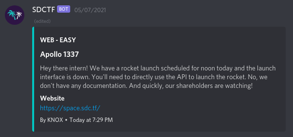
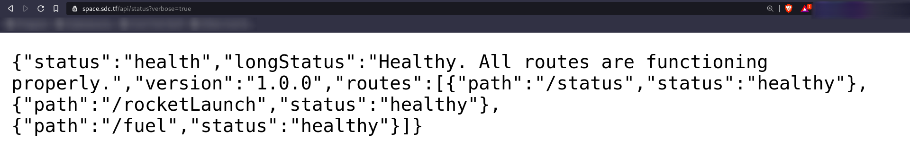
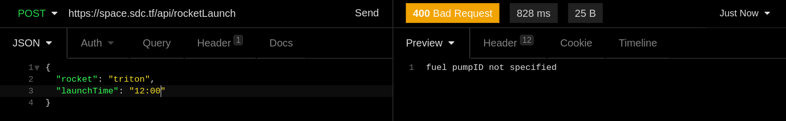

# Apollo 1337

## Author: [Anand Rajaram](https://github.com/anandrajaram21)

### Problem Statement

## TLDR

The problem statement first says that we have to launch the rocket with the help of the API. By inspecting the network tab in the chrome dev tools during the initial page load, we see that a get request is made to `/api/status?verbose=`. On accessing that page with the `verbose` parameter set to true, it gives us a list of api endpoints, one of which was `/api/rocketLaunch/`. On sending a POST request to that route with the required parameters, it asks us for a "frontend authorization token" for which we have to dig into the website source code. After finding the token and providing it along with the other parameters, it gives us the flag.

## Scanning

On examining the requests made during the initial page load, we find a request being made to the API route `/api/status?verbose=`. 

On navigating to `/api/status?verbose=true`, it gives us a list of API endpoints.

The `/rocketLaunch` endpoint looks interesting, lets check it out. On navigating to the route in the browser, we are told that the "request body must be json". Looks like we have to make a POST request. For this, I prefer using something like [Insomnia](https://insomnia.rest) over cURL as I like the interface better, and its also better suited for beginners like myself, but you may use whatever you like.  

We could probably guess a parameter and pass it into the body of the POST request. A reasonable parameter would be `"rocket"`  to specify which rocket to launch, and the value could be `"apollo"`. Lets give that a try.

Hmm, looks like that didnt work. But the response was very useful, as now we know that we have the right parameter name `"rocket"`, but the value was wrong. That can easily be changed. 

Looks like we need to specify a `"launchTime"`. From the problem statement, we know that the rocket needs to be launched at noon. So lets try that.

