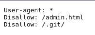
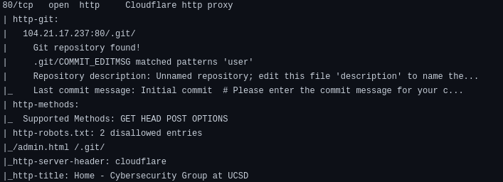
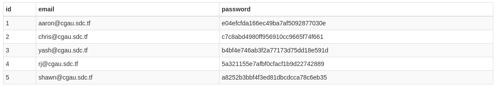
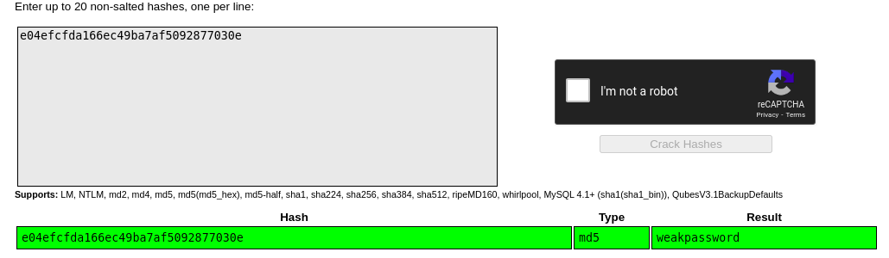
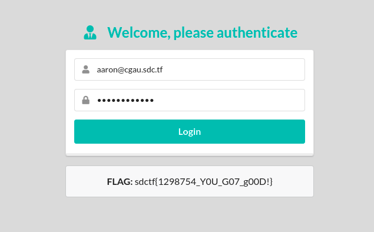

# Git Good

- Author: [Anand Rajaram](https://github.com/anandrajaram21)

## Problem Statement

## TLDR

The name of the challenge is Git Good, so there must be something related to git. If we were to be able to access the `.git` folder for that website, we could maybe gain access to the website source code, and maybe even the flag. ON digging some more, we find `/.git/COMMIT_EDITMSG` and `/admin.html`. We can use [GitTools](https://github.com/internetwache/GitTools) to dump and extract files from the remote `.git` folder. On navigating the file structure, we find a `users.db` SQLite database file, which contains emails and their password hashes. After cracking the password hashes, we can login with the email and password on the `/admin.html` page, which gives us the flag.

## Scanning

We should probably check out `robots.txt` for this website.

`/admin.html` and `/.git/` look very interesting. Going to `/admin.html` takes us to a login page, which asks us for an email and a password. We have no clue about either of them, so lets keep looking.

We can run a basic nmap scan on the host (output can be found in `nmap/initial`). On examining the results, we find some interesting stuff.

The nmap scan reveals the `.git` directory and the `COMMIT_EDITMSG` file. On navigating to `/.git/COMMIT_EDITMSG`, it starts to download the file on our local computer. This means that we can access the files of the `.git` folder.  

## Exploitation

On examining the `COMMIT_EDITMSG` file, we find a potential email address for the `/admin.html`page, `aaron@cgau.sdc.tf`. We also find a bunch of filenames, but the one that looks the most interesting is `users.db`. But we cannot access the `users.db` file just by navigating to `/users.db`, as it said forbidden. Our main aim is to somehow get the files from the `.git` folder. In the `.git` folder, objects are stored as blobs, so its not going to be easy to read them.

I personally spent some time trying to manually enumerate the `.git` folder and wasn't getting anywhere. I then came across [this github repository](https://github.com/internetwache/GitTools). This made everything so much simpler. By using the `Dumper` tool, we can download all possible files from that remote `.git` folder. After that, we have a local copy of all those files in the `.git` folder. But its the same problem again, we can not do anything with those blobs. Thats where the `Extractor` tool from the GitTools repo comes in. It tries to extract files and commits from a broken git repository. Perfect!  

We can use the `Extractor` tool to get a copy of the files in the `.git` folder. On navigating the files in our file explorer, we can finally get our hands on the `users.db` that we wanted all along. From the source code of the web app, we find that the database is an SQLite database. So we can use an online SQLite database viewer to view the `users.db`, and sure enough, there are emails and password hashes. Nice and easy.

The hash can be cracked easily with an online hash cracker like https://crackstation.net. On cracking the hash, we get the password of the `aaron@cgau.sdc.tf` email as `weakpassword`. Challenge solved.

Now we just go to `/admin.html` and login with the email as `aaron@cgau.sdc.tf` and password as `weakpassword` to get the flag.

## Thoughts

The challenge was overall, a fairly easy challenge. The CTF classified it as medium challenge, but it had more solves than all the easy web challenges. I had a lot of fun solving this challenge, and learned enumerating remote `.git` folders to gain access to interesting files. A great challenge overall!
