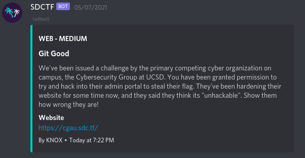
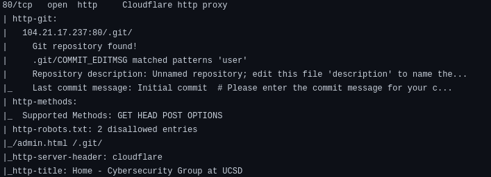
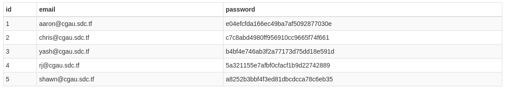
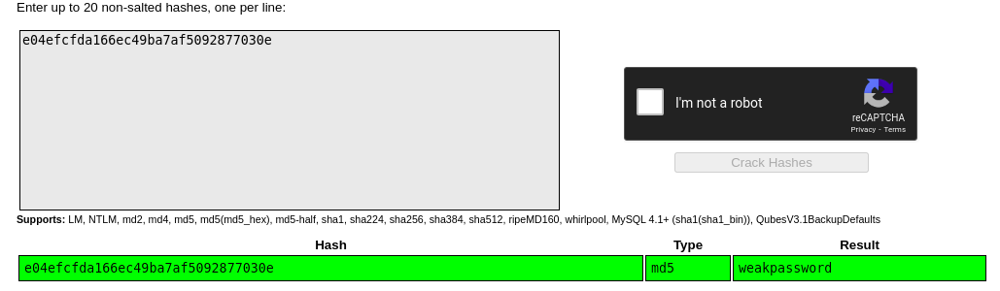
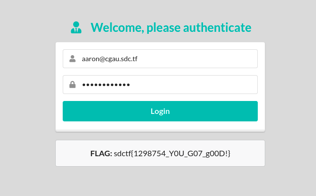

# Git Good

## Author: [Anand Rajaram](https://github.com/anandrajaram21)

### Problem Statement

## Thought Process

The name of the challenge was Git Good, so I was sure that there would be something related to git. If I were to be able to access the .git folder for that website, I could gain access to the website source code, and maybe even the flag. So I started digging.

## Scanning

I first went to the robots.txt page, and found /admin.html and /.git/. Going to /admin.html takes you to a login page, which asks you for an email and a password. I had no clue of either, so I just continued to enumerate.

I ran a basic nmap scan on the host (output can be found in nmap/initial). On examining the results, I found some interesting stuff.

The nmap scan revealed the .git directory and the COMMIT_EDITMSG file. I navigated to /.git/COMMIT_EDITMSG and it started to download the file on my local computer. This meant that I could access the files of the .git folder.  

## Exploitation

On examining the COMMIT_EDITMSG file, I found a potential email address for /admin.html page. aaron@cgau.sdc.tf. I also found a bunch of filenames, but the one that immediately caught my eye was users.db. But I could not access the users.db file just by navigating to /users.db, as it said forbidden. My main aim was to somehow get the files from the .git folder. In the .git folder, objects are stored as blobs, so it wasnt easy to read them.

I spent some time trying to manually enumerate the .git folder and wasn't getting anywhere. I then came across [this github repository](https://github.com/internetwache/GitTools). This made everything so much simpler. By using the "Dumper" tool, I downloaded all the possible files from that remote .git folder. After that, I had a local copy of all those .git files. But it was the same problem, I could not do anything with those blobs. Thats where the "Extractor" tool from the GitTools repo came in. It tries to extract files and commits from a broken git repository. Perfect!  

I used the "Extractor" tool to get a copy of the git repository files. On navigating the files on my computer, I was able to finally get access to the users.db that I wanted so much. From the source code, I get to know that the database is a SQLite database. So I used an online SQLite database viewer to view the users.db, and sure enough, there were emails and password hashes. Nice and easy.

The hash can be cracked easily with an online hash cracker like https://crackstation.net. On cracking the hash, we get the password of the aaron@cgau.sdc.tf email as `weakpassword`. Challenge solved.

Now we just go to /admin.html and login with the email as `aaron@cgau.sdc.tf` and password as `weakpassword` to get the flag.

## Thoughts

The challenge was overall, a fairly easy challenge. The CTF classified it as medium challenge, but it had more solves than all the easy web challenges. I had a lot of fun solving this challenge, and learned enumerating remote .git folders to gain access to interesting files
